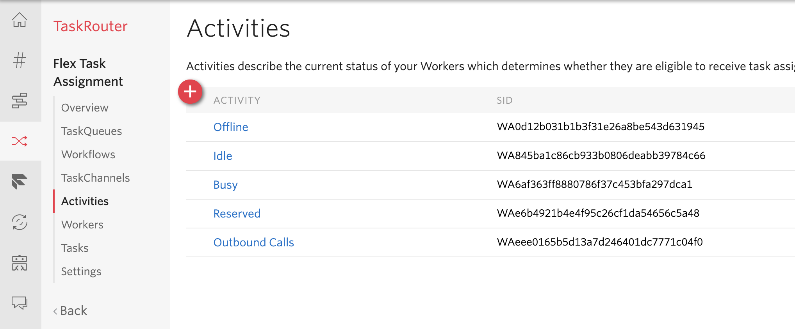

# plugin-flex-outbound-dialpad

This plugin is intended to demonstrate how to make outbound calls from [Twilio Flex](https://www.twilio.com/flex) that use the native call orchestration so the inbound call features such as supervisor monitoring as well as cold and warm transfer, also work for outbound calls.  This plugin also provides the ability to perform external conferencing which leverages the work on [this project](https://github.com/trogers-twilio/plugin-external-conference-warm-transfer)

### How It Works

This plugin uses a series of twilio functions to create an outbound call, listen for updates to that call and push the updates to the flex users via a sync document.  When the call is answered, the worker goes available in Flex to recieve the call via a task router task.  The front end puts the agent in a busy state while waiting for the task to arrive so that no other tasks are recieved.  To avoid a race condition, when the agent does go available, any tasks that are not the outbound call are auto rejected.  The worker goes into a busy state to avoid excessive reservation rejections.

### Dialpad

## Task Router Dependencies

### Workflow

Before using this plugin you must first create a dedicated TaskRouter workflow for outbound calls. You can do this [here](https://www.twilio.com/console/taskrouter/dashboard). Make sure it is part of your **Flex Task Assignment** workspace.

* Ensure there is the following matching workers expression for the only filter on the workspace.
  * `task.targetWorker === worker.contact_uri`
* Ensure the **priorty** of the filter is set to **1000** (or at least the highest in the system).
* Make sure the filter matches to a queue with Everyone on it. The default Everyone queue will work but if you want to seperate real time reporting for outbound calls, you should make a dedicated queue for it with a queue expression.
  * `1 === 1`

### Activities

This plugin forces the agent into an offline state to block calls while dialing out and an online state to accept the outbound call thats been placed.  You must ensure these are agent activity states are available for this plugin to work.  For both offline and available, two possible activities have been programmed, the plugin will try one of the activities and if its not available, try the other, if thats not available it will fail.  You can either provision one of the states or update the code to switch to an equivalent activity that you do have configured in Task Router.

Available states programmed by default (One of these must be configured in Task Router):
* Available
* Idle

Unavailable states programmed by default (One of these must be configured in Task Router):
* Outbound Calls
* Offline

## Twilio Serverless Dependency

You will need the [twilio CLI](https://www.twilio.com/docs/twilio-cli/quickstart) and the [serverless plugin](https://www.twilio.com/docs/labs/serverless-toolkit/getting-started) to deploy the functions you can install with the following commands

`npm install twilio-cli -g`

and then

`twilio plugins:install @twilio-labs/plugin-serverless`

## How To Use

1. Setup dependencies above, The workflow and the outbound calls worker activity.
2. Clone the repository.
3. Copy `./public/appConfig.example.js` to `./public/appConfig.js` and set your account sid.
4. Run `npm install`.
5. Copy `./dialpad-functions/.env.sample` to `./dialpad-functions/.env` and populate the appropriate SIDs.  The workflow sid should be the workflow dependency described above.
6. CD into `./dialpad-functions/` then run `npm install` and then `twilio serverless:deploy` (optionally you can run locally with `twilio serverless:start --ngrok=""`.
7. Take note of the domain of where they deployed and update `FUNCTIONS_HOSTNAME` in [./src/OutboundDialingWithConferencePlugin.js](./blob/master/src/OutboundDialingWithConferencePlugin.js).
7. Update the `DEFAULT_FROM_NUMBER` in [./src/OutboundDialingWithConferencePlugin.js](./blob/master/src/OutboundDialingWithConferencePlugin.js) to a twilio number or a verified number associated with your account.
8. CD back to the root folder and run `npm start` to run locally or `npm run-script build` and deploy the generated `./build/plugin-outbound-dialing-with-conference.js` to [Twilio Assests](https://www.twilio.com/console/assets/public) to include plugin with hosted Flex.

## Important Notes

* The plugin assumes an activity of `Outbound Calls` or `Offline` is configured for making the worker automatically unavailable, if these are not worker activity states that are available, you can either add them or update the code to change to a different state.  The same is true for ensuring an available activity of `Available` or `Idle` is in the system.
* This plugin is not compatible with the dialpad plugin that is listed as an `Experimental feature` - the expiremental feature or more recently, the `Pre Release` feature must be turned off.
* If you place a `phone` attribute on the worker and assign it a twilio or verified number, the call will be placed from that number instead of the default number.
* This solution doesnt support and is not suitable for direct agent to agent dialing.
* Since the call is routed to the agent only after the call is answered, there can be a perceived delay, typically less than a second, of the agent and the customer connecting on the conference. It is adviced to configure the hold music for the outbound call to be silence, this creates a smoother experience for the person being dialed.

## TODOs

1. Improve styling to better match base palette.
2. Add in improved text box for entering numbers with country code drop down.
3. Introduce callback task for making outbound calls from a callback .
4. Update plugin builder to use serverless:cli for plugin asset deployment and align functions hostname automatically.

## Changelog

v1.3 - Moved dialpad to main header to avoid the responsive rendering of the side nav unmounting when resizing the canvas.

v1.2 - converted plugin to use Twilio functions and sync docs to manage state.  Also merged in external transfer features.

v1.1 - added ringtone when dialing, DTMF tones while on a call and better state management.

- breaking change to url, must align with backend

v1.0 - initial release

## Code of Conduct

Please be aware that this project has a [Code of Conduct](https://github.com/twilio-labs/.github/blob/master/CODE_OF_CONDUCT.md). The tldr; is to just be excellent to each other ❤️
