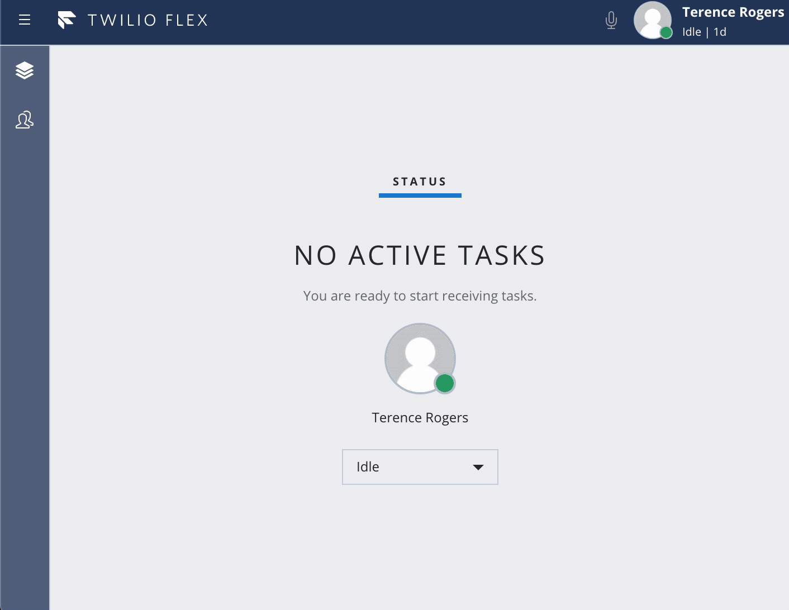

# plugin-flex-outbound-dialpad

This plugin is intended to demonstrate how to make outbound calls from [Twilio Flex](https://www.twilio.com/flex) without having to do any custom work around call conferencing and monitoring.  It has also merged in work for external transfers, taken from this [project](https://github.com/trogers-twilio/plugin-external-conference-warm-transfer)

This plugin uses a series of twilio functions to create an outbound call, listen for updates to that call and push the updates to the flex users via a sync document.  When the call is answered, the worker goes available in Flex to recieve the call via a task router task.  The front end puts the agent in a busy state while waiting for the task to arrive so that no other tasks are recieved.  To avoid a race condition, when the agent does go available, any tasks that are not the outbound call are auto rejected.  The worker goes into a busy state to avoid excessive reservation rejections.

# Dialpad

# External Transfer

# Workflow Dependencies
Before using this plugin you must first create a dedicated TaskRouter workflow for outbound calls. You can do this [here](https://www.twilio.com/console/taskrouter/dashboard). Make sure it is part of your **Flex Task Assignment** workspace.

- ensure there is the following matching workers expression for the only filter on the workspace
  - task.targetWorker==worker.contact_uri
- ensure the **priorty** of the filter is set to **1000** (or at least the highest in the system)
- make sure the filter matches to a queue with Everyone on it. The default Everyone queue will work but if you want to seperate real time reporting for outbound calls, you should make a dedicated queue for it with a queue expression
  - 1==1

# Twilio Serverless Dependency
You will need the [twilio CLI](https://www.twilio.com/docs/twilio-cli/quickstart) and the [serverless plugin](https://www.twilio.com/docs/labs/serverless-toolkit/getting-started) to deploy the functions you can install with the following commands

`npm install twilio-cli -g`
and
`twilio plugins:install @twilio-labs/plugin-serverless`

# How to use

1. Clone repository

2. Copy ./public/appConfig.example.js to ./public/appConfig.js and set your account sid

3.  run `npm install`

4. copy ./dialpad-functions/.env.sample to ./dialpad-functions/.env and populate the appropriate SIDs.  The workflow sid should be the workflow dependency described above 

5.  cd ./dialpad-functions/ then run `npm install` and then `twilio serverless:deploy` (optionally you can run locally with `twilio serverless:start --ngrok=""`

6.  Take note of the domain of where they deployed and update FUNCTIONS_HOSTNAME in ./src/OutboundDialingWithConferencePlugin.js

7.  Update the DEFAULT_FROM_NUMBER in ./src/OutboundDialingWithConferencePlugin.js to a twilio number or a verified number associated with your account.

8. run `npm start` to run locally or `npm run-script build` and deploy the generated ./build/plugin-outbound-dialing-with-conference.js to [twilio assests](https://www.twilio.com/console/assets/public) to include plugin with hosted Flex

# Important Notes
The plugin assumes an activity of "Busy" or "Offline" is configured for making the worker automatically unavailable, and it assumes activities "Idle" or "Available" are configured for automatically going available, if these are not worker activity states that are available, you can either add them or update the code to change to a different state.

# Changelog

v1.2 - converted plugin to use Twilio functions and sync maps to manage state.  Also merged in external transfer features.

v1.1 - added ringtone when dialing, DTMF tones while on a call and better state management.

- breaking change to url, must align with backend

v1.0 - initial release

## Code of Conduct

Please be aware that this project has a [Code of Conduct](https://github.com/twilio-labs/.github/blob/master/CODE_OF_CONDUCT.md). The tldr; is to just be excellent to each other ❤️

# TODOs

1. improve styling to better match base palette
